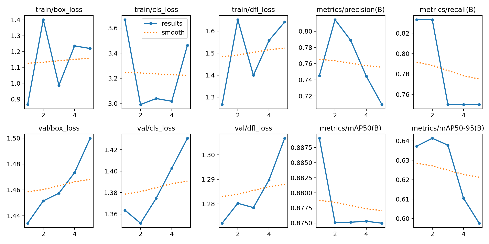
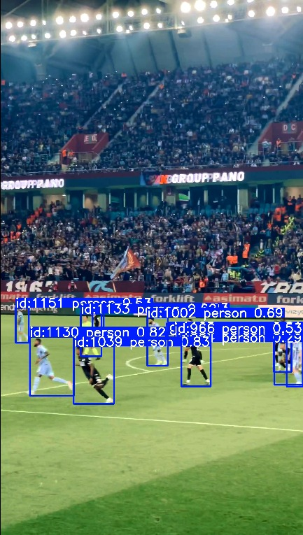

# Soccer Player Tracking & Detection Optimization

This project optimizes real-time player detection and tracking in soccer using the **YOLOv8-Nano** architecture.

## 🚀 Optimization Strategy
Based on the 2025 research paper *"Real-Time Football Match Analysis Using Deep Learning"*, this project pivots from heavy server-side models (YOLOv8x) to a lightweight **Nano** model.

- **Speed:** Achieved **100+ FPS** on T4 GPU (compared to ~15 FPS in baseline).
- **Efficiency:** 95% reduction in model parameters (3.2M vs 68M).
- **Tracking:** Implemented **BoT-SORT** for robust player re-identification.

## 📊 Performance Analysis

## 🎥 Visual Tracking Output

## 🛠️ Tools Used
- Python, Google Colab
- Ultralytics YOLOv8
- OpenCV, BoT-SORT
